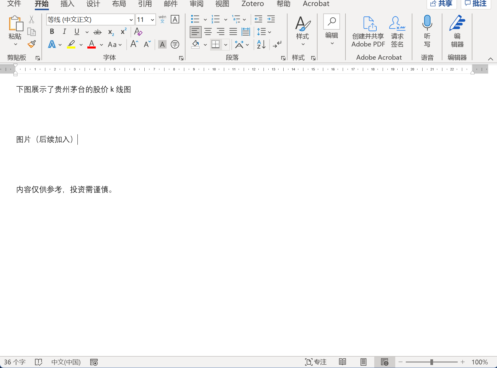
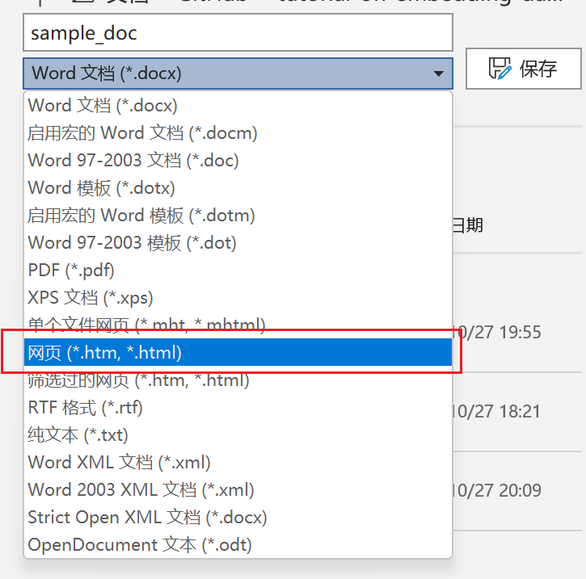
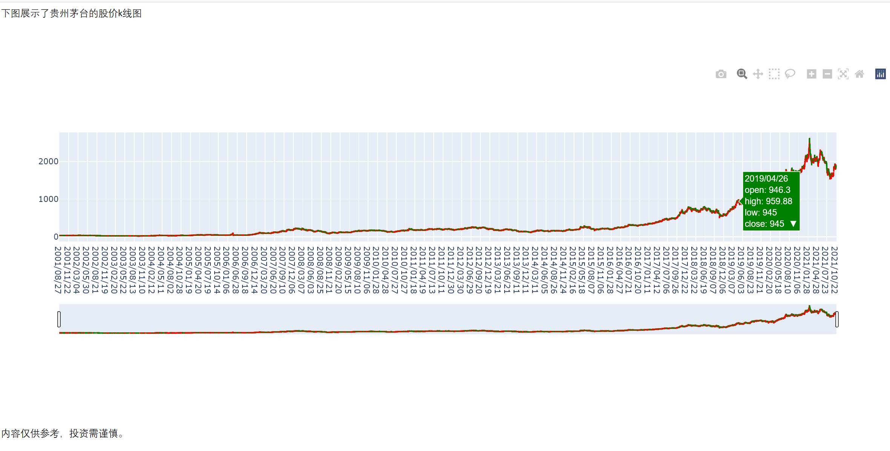

# tutorial-on-embedding-data-visualization-into-html
> EXCLUSIVE. For my beautiful and cute wife only.

this tutorial aims to finish THREE popular tasks concerning data analysis, data visualization and combining it into html file, a.k.a for the purpose of using the analysis elsewhere other than local computer

# Step 1: data analysis
## 1.1 fecth data
Since my wife is interested in financial area and curious about plotting beatiful and interactive k-lines, this tutorial will focus on build plot of such kind.

To fetch the data we want to plot with, we need to install a popular python package named [`tushare`](https://tushare.pro/register) and sign up for a particular token which will be passed into the code for data fetching.

Use your account to log into the [site](https://tushare.pro/) for further steps. Meanwhile, open a prompt / powershell window, and install `tushare` package simply by typing `pip install tushare`, and then downloading and installing process will automatically start.

After log in to the `tushare` site, you need to navigate to the user center and find below the `接口Token` panel and copy your token. 


With the token you just found, you are now able to request data from  `tushare` using the user-friendly api provided by them. You may not be familiar with what api is, but all you need to know about it is api is the first approach you should try if you want to fetch from a data source, and if it is not available, then other approached may be considered such as web crawler and manually downloading.

Below is the data fetching part of the code, quite simple. You could refer to the `tushare` [website](https://waditu.com/document/2?doc_id=27) for more information about the basic usage of the `tushare.pro_api` function.
```python
import tushare as ts
token = 'which you need to replace with your own token'
pro = ts.pro_api(token)
df = pro.daily(ts_code='600519.SH', start_date='20000101', end_date=20211027)
```

> BTW, I love this magic liquid gold and I definitely will hold some stock of 600519.SH someday if I could afford to. 

You may notice that `pro.daily` function returns a dataframe (here it is named as `df`). So, we could investigate some of its attributes and data structure of this dataframe. Like showing all of the columns contained in the dataframe

```python
print(df.columns)
# Index(['ts_code', 'trade_date', 'open', 'high', 'low', 'close', 'pre_close','change', 'pct_chg', 'vol', 'amount'],dtype='object')
```

or the first rows of the Excel-like dataset
```python
print(df.head())
'''
     ts_code trade_date     open  ...  pct_chg       vol       amount
0  600519.SH   20211027  1852.30  ...  -2.2595  34647.29  6302270.905
1  600519.SH   20211026  1864.03  ...  -0.6396  21130.26  3934223.714
2  600519.SH   20211025  1880.00  ...  -1.4713  32461.33  6076219.948
3  600519.SH   20211022  1855.00  ...   3.0911  35962.60  6794850.056
4  600519.SH   20211021  1841.10  ...   0.1630  23018.70  4238584.294
'''
```

## 1.2 preprocess the dataset
Now we are moving on. A simple convention for a dataframe containing an unique timestamp at each row is to use the timestamp as its index. And we noticed that the original data return by `tushare` contains a column named `trade_date` BUT it is not well parsed so it is not recognized as a column of timestamp by now. Moreover, the timestamps are not sorted increasingly, as we noticed the most recent dates are shown at the top rows. Based on the mentioned, we will use `trade_date` as the index of the datafram and convert the new index into the datatime format using `pandas.to_datetime` function and then we sort the index. Nice! The dataset is ready for plot

```python
import pandas as pd
df.index = df['trade_date']
df.index = pd.to_datetime(df.index)
df.sort_index(inplace=True)
```

# Step 2: Plot with `Plotly`
Plotly is a powerful tool producing interactive charts, and without question it has its python package. Install this package by typing `pip install plotly` into your terminal or shell.

# 2.1 produce a plot
Don't be freaked out by the code since it only contains the assignment to the varible `fig` and then `fig` is called by `fig.show()`. If you are lucky, then the default browser on your computer will automatically render a new tab for your plot. If you are not lucky, well, my wife can turn to me but you may turn to `stackoverflow` or `CSDN`
```python
import plotly.graph_objects as go

fig = go.Figure(data=[
    go.Candlestick(x=df.index.strftime("%Y/%m/%d"),
                   open=df.open,
                   high=df.high,
                   low=df.low,
                   close=df.close,
                   increasing=dict(line_color='red'),
                   decreasing=dict(line_color='green')
                   )
])

fig.show()
```
You may have discovered that k-lines is acually a candlestick plot using `open price`, `high price`, `low price`, `close price` and the candle stick is composed as the picture below.

# 2.2 save the plot as a html file
After we need to export the plot into a html file so that we could embed it elsewhere. Simply use the following code:
```python
fig.write_html('sample_plot.html')
```
and a file named `sample_plot.html` will be saved at the parallel path to the python code file you are using.

# Step 3: use the plot at a html.
We know that construct a beautiful webpage requires lots of work. And for the occasions we only want to exhibit some text and pictures, `MS Word` is the first option. 

We create a simple word document as shown in the picture below



We then save the file as a html file by clicking `文件-另存为`, and select the file type as illustrated. 



And then use a text editor software to modify the doc, here we use `Visual Studio Code` for demonstration.

We navigate the position we want to insert the plot. 


And we delete the text block and add the following code.

```html
<iframe scrolling="no" style="border:none;" seamless="seamless" 
src="https://qj4chen.github.io/sample_plot/" 
height="500" width="100%">
</iframe>
```
And pay attention to the source here `src="https://qj4chen.github.io/sample_plot/" `. It means you need to create a github repository named `sample_plot` to host the page.

Then again, if you have question about this, feel free to consult to the web for solution. But if you are my wife, please ask me any time and I will fix it to you. Nevertheless, this [post](https://blog.imfing.com/2021/04/html-webpage-embed-plotly/) may be helpful.

# Finally
Thanks to `plotly` and `Github`, we can now render our analysis to the Magic Liquid Gold in China vividly in our browser.


