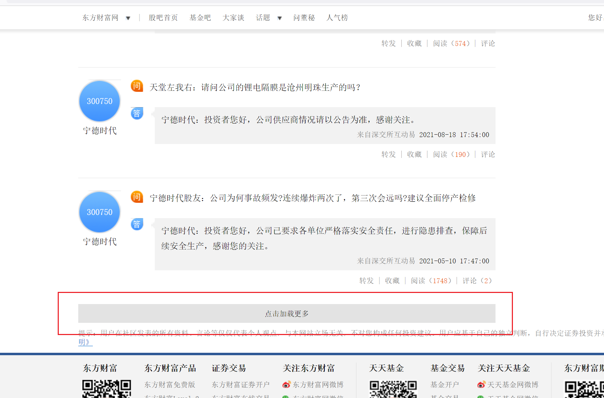
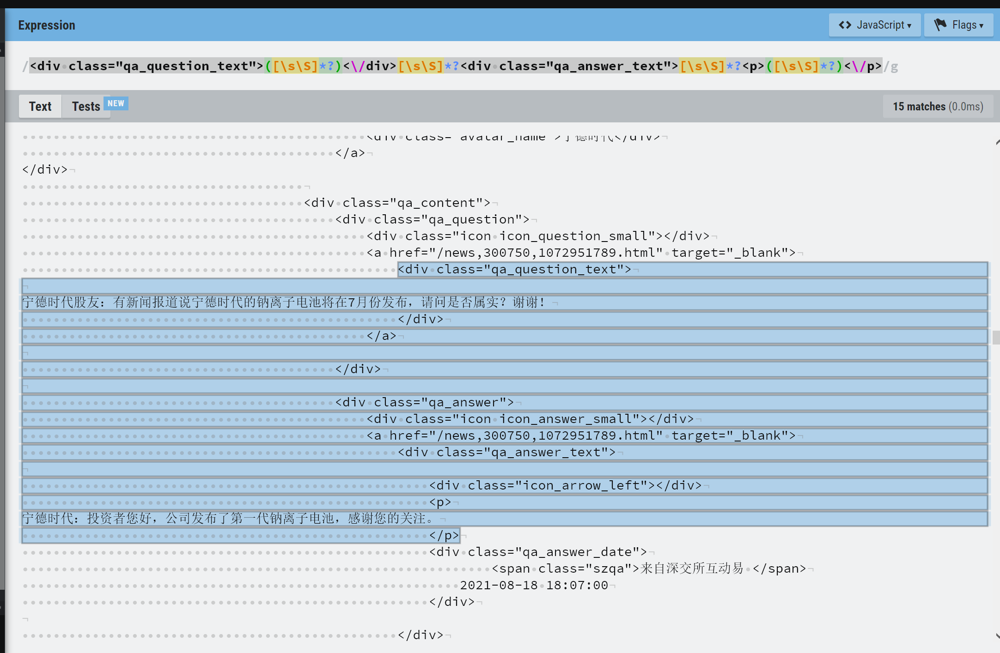
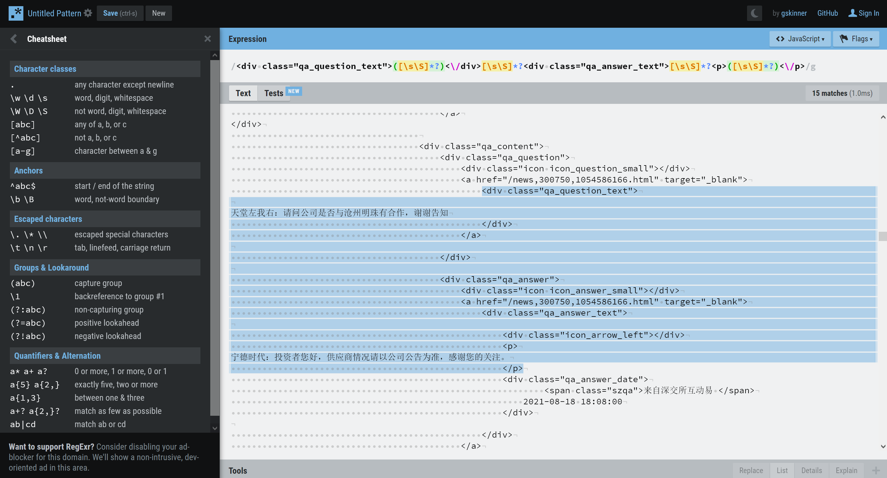

>本文在已有原始数据的基础上, 使用正则表达式`regular expression`, 提取投资者和上市公司高管之间的有趣问答. 
>
>据观察, 这种基础性的自然语言处理技巧被广泛地运用在部分财经媒体的``AI新闻``模块

# 获取数据

[东方财富网](https://www.eastmoney.com/)是一个庞大的财经门户网站, 里面每天都有大量的官方推送和用户生成的内容.

我们的教程也从东方财富网开始.

在[东方财富](https://so.eastmoney.com/web/s?keyword=)的网站上搜索某家股票, 点进结果, 拉到最下, 就能看到如下的`某家股票吧`. 下图展示了"宁德时代"的页面. 可以看到, 在最右边一栏有`问董秘`板块, 点进去之后就是投资者和上市公司之间的各种奇葩对话了. 


假设我们还没有掌握爬虫技巧, 那么我们想做的事情就是多次点击页面中的`点击加载更多`, 让页面展示了足够多的问答数据之后, 再`右键`-`查看网页源代码`.



在一个新弹出的页面里面, 我们可以看到一些`html`代码, 我们按`ctrl+A`将它们全部选中, 然后复制, 粘贴到一个记事本文件里, 保存成`data.txt`

有了数据, 接下来就能开始解析了. 

值得一提的是, 如果引入`爬虫`的技术, 其本质上就是把我们人工点击`点击加载更多`按钮的过程交给一个机器人来做, 显然, 这样更省时省力.

# 把文本导入进来

一般而言, 导入一个`.txt`文件, 我们直接使用`python`的`open(文件名).read()`方法就可以了, 也就是`html = open('./data.txt').read()`. 但有的时候, 如果需要读取的文本很大, 一个更安全的做法是使用如下的做法:
```python
with open('./data.txt') as file:
    html = file.read()
```
到这一步, 一个名为`html`的字符串类型的数据, 已经存在于我们的console里了
# 调试正则表达式
> 上帝: 没有人能一步写100%正确的正则表达式

什么是正则表达式呢? 

简单地说,  正则表达式就是想用一种**通用**的方法来表示一批具有某种相同特征的文本. 以我们刚刚获取的html代码为例:



每一对**宁德时代的股民**与**宁德时代**的对话, 它们周围都有一些相似的html标记. 比如, 如果不算`换行符`和`空格`之类的干扰,  ` <div class="qa_question_text">`之后, 接的一般都是**宁德时代的股民**的提问; 而`<div class="qa_answer_text">`之后, 并不直接跟着**宁德时代**的回答, 而是


```html
<div class="icon icon_answer_small"></div>
                                        <a href="/news,300750,1072951789.html" target="_blank">
                                            <div class="qa_answer_text">

                                                <div class="icon_arrow_left"></div>
                                                <p>
```

这样一些乱七八糟的html标记.

我们找到了**宁德时代的股民**与**宁德时代**的对话的"规律"!

对了, 上面那张截图是在这个[网站](https://regexr.com/)截取的. 上帝说"没有人能一步写好100%正确的正则表达式", 但是`https://regexr.com/`给我们提供了一个便捷地调试正则表达式的platform.

# 究竟什么是正则表达式

我们今天要写的正则表达式长这样: `<div class="qa_question_text">([\s\S]*?)<\/div>[\s\S]*?<div class="qa_answer_text">[\s\S]*?<p>([\s\S]*?)<\/p>`

而我们在`https://regexr.com/`上, 在`Expression`一栏里填入这个正则表达式, 把最开始复制的`网页源代码`粘贴进下面的大空白, 然后找到了15个匹配项. 下图里, 蓝色高亮的就是其中一个匹配项.



我们来拆解这个长长的正则表达式.

`<div class="qa_question_text">`无需多说, 它是我们想要匹配的文本的`开头`, 我们希望能够**精确地找到**`<div class="qa_question_text">`.

同样地, `<\/div>`, `<div class="qa_answer_text">`, `<p>`, `<\/p>`都是我们想要精确匹配的. 我们可以把它们理解成扫描二维码时用来定位的那几个大黑块, 它们并不携带我们想要的信息, 但是我们想要的信息被包裹在其中.

